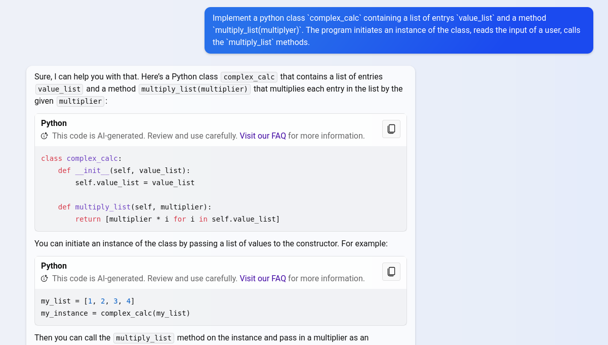

<!--
author:   André Dietrich

email:    LiaScript@web.de

version:  0.0.1

language: en

narrator: US English Female

import: https://raw.githubusercontent.com/LiaScript/CodeRunner/master/README.md

-->

[](https://liascript.github.io/course/?https://raw.githubusercontent.com/SebastianZug/PythonCourse_2023/main/README.md#1)

# Python Summer School 2023 - Part B - 2th September

Organizers and Lectureres 

+ Yekaterina Strigina
+ Sebastian Zug (TU Bergakademie Freiberg)


------------------------------------------------------------

## Agenda of this day

| Slot          | Topic                                                      |
|---------------|----------------------------------------------------------- |
| 10:00 - 11:15 | Review, comparison of Jupyter notebooks and Python scripts |
| 11:30 - 12:45 | Introduction to image processing based on opencv           |
| 12:45         | Lunch                                                      |
| 13:30 - 14:45 | Basics of data analysis using pandas                       |
| 15:00 - 16:15 | Visualisation of pandas data frames                        |

## Remember the previous tutorial ...

> __Task:__ Implement a python class `complex_calc` containing a list of entrys `value_list` and a method `multiply_list(multiplyer)`. The program initiates an instance of the class, reads the input of a user, calls the `multiply_list` methods.

> __Hint:__ Use [ChatGPT](https://www.bing.com/search?q=Bing+AI&showconv=1&FORM=hpcodx) or any other AI to fasten up your coding. 
> 
> 

{{1}}
```python Solution.py
# Object definition
class complex_calc:
    def __init__(self, value_list):
        self.value_list = value_list

    def multiply_list(self, multiplier):
        return [multiplier * i for i in self.value_list]

# Initialization of an object instance
my_list = [1, 2, 3, 4]
my_instance = complex_calc(my_list)

# Apply mathmatical operation
multiplier = 2
result = my_instance.multiply_list(multiplier)

print(result)  
```
@LIA.eval(`["main.py"]`, `none`, `python3 main.py`)