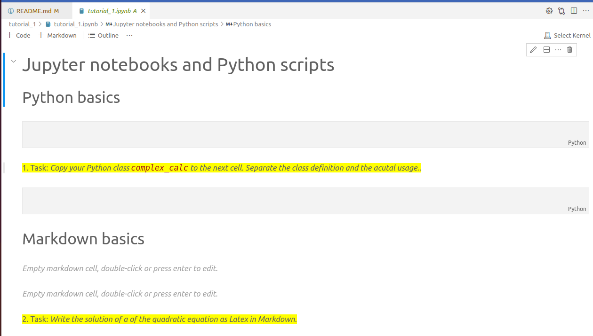
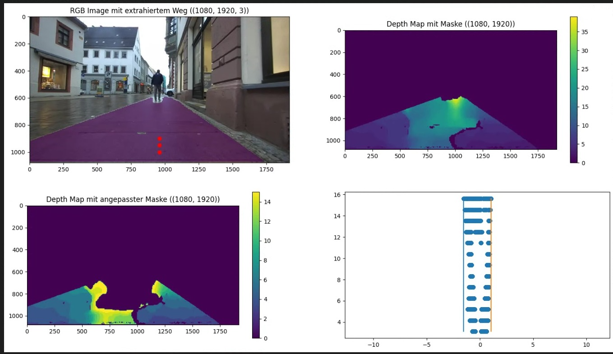

<!--
author:   André Dietrich

email:    LiaScript@web.de

version:  0.0.1

language: en

narrator: US English Female

import: https://raw.githubusercontent.com/LiaScript/CodeRunner/master/README.md

-->

[](https://liascript.github.io/course/?https://raw.githubusercontent.com/SebastianZug/PythonCourse_2023/main/README.md#1)

# Python Summer School 2023 - Part B - 2th September

Organizers and Lectureres 

+ Yekaterina Strigina
+ Sebastian Zug (TU Bergakademie Freiberg)

------------------------------------------------------------

## Organisation

__Agenda of this day__

| Slot          | Topic                                                      |
|---------------|----------------------------------------------------------- |
| 10:00 - 11:15 | Review, comparison of Jupyter notebooks and Python scripts |
| 11:30 - 12:45 | Introduction to image processing based on opencv           |
| 12:45         | Lunch                                                      |
| 13:30 - 14:45 | Basics of data analysis using pandas                       |
| 15:00 - 16:15 | Visualisation of pandas data frames                        |


### Backgrounds and expectations

                     {{0-1}}
***************************************************************

My background
---------------

+ Prof. for Software development and Robotics at Technische Universität Freiberg since 2018
+ Working with Python since 15 years especially in robotic contexts


_Impressions of project __RobotTraces__ implemented by Hochschule Schmalkalden and Technische Universität Freiberg_

***************************************************************

                     {{1-2}}
***************************************************************

Your background
--------------------

What's your study topic?

Why are you interested to improve your coding skills?

The summer school is this your first coding experience?

What do you expect from this event?

***************************************************************

### Preparation

__Step 1:__ Please install the following Python packages on your maschine:

+ opencv - `pip install opencv-python`
+ pandas - `pip install pandas`

__Step 2:__ Additionally, it is necessary to add the [Jupyter](https://marketplace.visualstudio.com/items?itemName=ms-toolsai.jupyter)
package to your Visual Studio Code environment. 


__Step 3:__ Check the correctness of the implementation by opening a new file (shown in the move above) and adding the following code

```
import pandas as pd

pd.__version__
```

If something like `'1.5.0'` appears everything is fine. In case of `ModuleNotFoundError: No module named 'pandas'` check the installation outputs of Step 1.

__Step 4:__ Install the [vscodeintellicode](https://marketplace.visualstudio.com/items?itemName=VisualStudioExptTeam.vscodeintellicode) plugin in your Visual Studio Code environment. It supports your coding by providing code completion and code suggestions.

__Step 4:__ Generate an ChatGPT account - we will use the AI for boosting our programming activities.

!?[](https://www.youtube.com/watch?v=ei-WirjwtOM)

### Warm up

> __Task:__ Implement a Python class `complex_calc` containing a list of entrys `value_list` and a method `multiply_list(multiplyer)`. The program initiates an instance of the class, reads the input of a user, calls the `multiply_list` methods.

> __Hint:__ Use [ChatGPT](https://www.bing.com/search?q=Bing+AI&showconv=1&FORM=hpcodx) or any other AI to fasten up your coding. 
> 
> 

{{1}}
```python Solution.py
# Object definition
class complex_calc:
    def __init__(self, value_list):
        self.value_list = value_list

    def multiply_list(self, multiplier):
        return [multiplier * i for i in self.value_list]

# Initialization of an object instance
my_list = [1, 2, 3, 4]
my_instance = complex_calc(my_list)

# Apply mathmatical operation
multiplier = 2
result = my_instance.multiply_list(multiplier)

print(result)  
```
@LIA.eval(`["main.py"]`, `none`, `python3 main.py`)

## Session 1 - Review, comparison of Jupyter notebooks and Python scripts 

> What's the general idea of the code example above?

1. Write Code 
2. Start the Python interpreter

__Python scripts__ are ideal for automation, integration, and deployment, as they are portable, flexible, and easy to maintain. They are executed linearly, in a top-down fashion. The output is displayed in the terminal or console. Code is shared as plain text files.

{{1}}
On the other hand, __Jupyter Notebooks__ execute python code too. But they are ideal for data exploration and visualization, as they are interactive and support rich media. They consist of multiple cells that can contain either a block of Python code or plain text. Cells can be executed in any order. The output is displayed in the notebook. Code is shared as notebook files.

### Just do it

> Let's start to do some practical work ! Download [Notebook](https://github.com/SebastianZug/PythonCourse_2023/archive/refs/heads/main.zip) to your computer and open it as a project folder.



{{1}}
> Who searches for the mouse, graps and moves it for writing code has to much time!

{{1}}
| Button              | Meaning                                                                                                 |
| ------------------- | ------------------------------------------------------------------------------------------------------- |
| Ctrl+S              | Save                                                                                                    |
| ESC                 | Change the cell mode                                                                                    |
| A                   | Add a cell above                                                                                        |
| B                   | Add a cell below                                                                                        |
| J or down arrow key | Change a cell to below                                                                                  |
| K or up arrow key   | Change a cell to above                                                                                  |
| Ctrl+Enter          | Run the currently selected cell                                                                         |
| Shift+Enter         | Run the currently selected cell and insert a new cell immediately below (focus moves to new cell)       |
| Alt+Enter           | Run the currently selected cell and insert a new cell immediately below (focus remains on current cell) |
| dd                  | Delete a selected cell                                                                                  |
| z                   | Undo the last change                                                                                    |
| M                   | switch the cell type to Markdown                                                                        |
| Y                   | switch the cell type to code                                                                            |
| L                   | Enable/Disable line numbers                                                                             |

### Summary

| **Feature**               | **Python Scripts**                                        | **Jupyter Notebooks**                                     |
| ------------------------- | --------------------------------------------------------- | --------------------------------------------------------- |
| File extension            | .py                                                       | .ipynb                                                    |
| Text editor               | Any text editor or IDE                                    | Not meant to be directly opened with text editors         |
| Execution                 | Linearly, in a top-down fashion                           | Cells can be executed in any order                        |
| Output display            | Output is displayed in the terminal or console            | Output is displayed in the notebook                       |
| Code sharing              | Code is shared as plain text files                        | Code is shared as notebook files                          |
| Data visualization        | Not ideal for data visualization                          | Ideal for data exploration and visualization              |
| Automation and deployment | More suitable for automation, integration, and deployment | Less suitable for automation, integration, and deployment |

## Session 2 - Introduction to image processing based on opencv 

> What does it mean "image processing"?

_In computer science and electrical engineering, image processing is the processing of signals that represent images, for example photographs or frames from videos. The result of image processing can in turn be an image or a set of features of the input image._ (Wikipedia)

The whole story is "slightly" more complex :-)

```ascii
                    +----------------------+
                    | Preprocessing        |  Thresholding, Resizing, Smoothing, ...
                    +----------------------+
                               |              
                               v             
                    +----------------------+
                    | ....                 |  
                    +----------------------+
                               |                          
                               v
                    +----------------------+
                    | Feature extraction   |  Identification of obstacles, humans ...
                    +----------------------+
                               |
                               v
                    +----------------------+
                    | ....                 |  
                    +----------------------+
                               |
            +------------------+-----------------+
            |                                    |
            v                                    v
  +----------------------+            +----------------------+
  | Visualization        |            | Interpretation       |
  +----------------------+            +----------------------+
                                  
    2D, 3D, Features, ...               Counts, Distances ...                                                   

```


### How does a computer represent an image?

```python ColoredImage.py
import numpy as np
import cv2
from matplotlib import pyplot as plt

# 3x3 matrix
red = np.array([[0, 255, 255],
                [0, 255, 0],
                [0, 255, 0]])

green = np.array([[0, 255, 0],
                  [0, 255, 0],
                  [0, 255, 255]])

blue = np.array([[255, 255, 0],
                   [0, 255, 0],
                   [0, 255, 0]])

rgb_image =  cv2.merge((blue, green, red))  # <-- What do you think about the order? BGR
#cv2.cvtColor(resized, cv2.COLOR_BGR2RGB)

#plt.imshow(rgb_image)
resized = cv2.resize(rgb_image, (300,300), interpolation= cv2.INTER_NEAREST)
cv2.imwrite("filename.png", resized)
```
@LIA.eval(`["main.py"]`, `none`, `python3 main.py`)

### Which tools we are using?

> _OpenCV (Open Source Computer Vision Library) is a library of programming functions mainly for real-time computer vision. Originally developed by Intel, it was later supported by Willow Garage, then Itseez (which was later acquired by Intel). The library is cross-platform and licensed as free and open-source software under Apache License 2. Starting in 2011, OpenCV features GPU acceleration for real-time operations._ (Wikipedia)

!?[](https://www.youtube.com/watch?v=oXlwWbU8l2o)


### Just do it

The repository you downloaded contains a second tutorial folder `tutorial_2`. Please open the folder and start the notebook `tutorial_2.ipynb`.


## Session 3 - Basics of data analysis using pandas 


> _Data analysis is the process of inspecting, cleansing, transforming, and modeling data with the goal of discovering useful information, informing conclusions, and supporting decision-making._ (Wikipedia)

Let us assume, that we want to analyse movie data from the [Internet Movie Database (IMDb)](https://www.imdb.com/). Its a large database of movies, series, actors, directors and other information related to the film industry.  The data is stored in a CSV file. 

```
Rank,Title,Genre,Description,Director,Actors,Year,Runtime (Minutes),Rating,Votes,Revenue (Millions),Metascore
1,Guardians of the Galaxy,"Action,Adventure,Sci-Fi",A group of intergalactic criminals are forced to work together to stop a fanatical warrior from taking control of the universe.,James Gunn,"Chris Pratt, Vin Diesel, Bradley Cooper, Zoe Saldana",2014,121,8.1,757074,333.13,76
2,Prometheus,"Adventure,Mystery,Sci-Fi","Following clues to the origin of mankind, a team finds a structure on a distant moon, but they soon realize they are not alone.",Ridley Scott,"Noomi Rapace, Logan Marshall-Green, Michael Fassbender, Charlize Theron",2012,124,7,485820,126.46,65
3,Split,"Horror,Thriller",Three girls are kidnapped by a man with a diagnosed 23 distinct personalities. They must try to escape before the apparent emergence of a frightful new 24th.,M. Night Shyamalan,"James McAvoy, Anya Taylor-Joy, Haley Lu Richardson, Jessica Sula",2016,117,7.3,157606,138.12,62
4,Sing,"Animation,Comedy,Family","In a city of humanoid animals, a hustling theater impresario's attempt to save his theater with a singing competition becomes grander than he anticipates even as its finalists' find that their lives will never be the same.",Christophe Lourdelet,"Matthew McConaughey,Reese Witherspoon, Seth MacFarlane, Scarlett Johansson",2016,108,7.2,60545,270.32,59
5,Suicide Squad,"Action,Adventure,Fantasy",A secret government agency recruits some of the most dangerous incarcerated super-villains to form a defensive task force. Their first mission: save the world from the apocalypse.,David Ayer,"Will Smith, Jared Leto, Margot Robbie, Viola Davis",2016,123,6.2,393727,325.02,40
```

Our data set is reduced to 1000 entries. Feel free to run the investigation with the actual data base containing thousands of movies and much more information. [Link](https://developer.imdb.com/non-commercial-datasets/)

### Alternative approaches

                           {{0-1}}
**************************************************************

How learn to manage data at school?

"](https://www.openoffice.org/product/pix/calc-big.png)

Excel / Calc is mostly used in interactive mode. I click at a cell, write an input or formula. For analysis, formats etc. the user addresses functionality in a menu.

> What happens, if a new data set appears?

**************************************************************

                           {{1-2}}
**************************************************************

```text data.csv 
Rank,Title,Genre,Description,Director,Actors,Year,Runtime (Minutes),Rating,Votes,Revenue (Millions),Metascore
1,Guardians of the Galaxy,"Action,Adventure,Sci-Fi",A group of intergalactic criminals are forced to work together to stop a fanatical warrior from taking control of the universe.,James Gunn,"Chris Pratt, Vin Diesel, Bradley Cooper, Zoe Saldana",2014,121,8.1,757074,333.13,76
2,Prometheus,"Adventure,Mystery,Sci-Fi","Following clues to the origin of mankind, a team finds a structure on a distant moon, but they soon realize they are not alone.",Ridley Scott,"Noomi Rapace, Logan Marshall-Green, Michael Fassbender, Charlize Theron",2012,124,7,485820,126.46,65
3,Split,"Horror,Thriller",Three girls are kidnapped by a man with a diagnosed 23 distinct personalities. They must try to escape before the apparent emergence of a frightful new 24th.,M. Night Shyamalan,"James McAvoy, Anya Taylor-Joy, Haley Lu Richardson, Jessica Sula",2016,117,7.3,157606,138.12,62
4,Sing,"Animation,Comedy,Family","In a city of humanoid animals, a hustling theater impresario's attempt to save his theater with a singing competition becomes grander than he anticipates even as its finalists' find that their lives will never be the same.",Christophe Lourdelet,"Matthew McConaughey,Reese Witherspoon, Seth MacFarlane, Scarlett Johansson",2016,108,7.2,60545,270.32,59
5,Suicide Squad,"Action,Adventure,Fantasy",A secret government agency recruits some of the most dangerous incarcerated super-villains to form a defensive task force. Their first mission: save the world from the apocalypse.,David Ayer,"Will Smith, Jared Leto, Margot Robbie, Viola Davis",2016,123,6.2,393727,325.02,40
```
```python readCSV.py
import csv

# Einlesen der Daten
with open('data.csv', mode='r') as csv_file:
    csv_reader = csv.DictReader(csv_file, delimiter=',',)
    list_of_dict = list(csv_reader)

# "Analyse" und Ausgabe
print(f"{len(list_of_dict)} data set found!")
for row in list_of_dict:
	if row['Title']=='Prometheus':
		print(row)

csv_file.close()
```
@LIA.eval(`["data.csv", "main.py"]`, `none`, `python3 main.py`)

> Obviously, ...
> 
> - the code becomes quite complex if we intend to support more complex queries
> - we have to implement many methods for filtering, data extraction, ..., visualisation
> - the performance is quite low
>
> ... by using pure Python code.

**************************************************************

                           {{2-3}}
**************************************************************

[pandas](https://pandas.pydata.org/) is a software library written for the Python programming language for data manipulation and analysis, providing in particular data structures and operations for manipulating numerical tables and time series. It is free software.

The name is derived from the term "_panel data_", a term used in econometrics for data sets containing observations over multiple time periods for the same individuals.

> What are the advantages of pandas?

1. Scalability: Pandas is built on NumPy (Numerical Python) and can handle larger quantities of data than Excel. It is only limited by hardware 1.
2. Speed: Pandas is much faster than Excel, especially when working with larger quantities of data 1.
3. Automation: Many tasks that can be achieved with Pandas are extremely easy to automate, reducing the amount of tedious and repetitive tasks that need to be performed daily

```text data.csv 
Rank,Title,Genre,Description,Director,Actors,Year,Runtime (Minutes),Rating,Votes,Revenue (Millions),Metascore
1,Guardians of the Galaxy,"Action,Adventure,Sci-Fi",A group of intergalactic criminals are forced to work together to stop a fanatical warrior from taking control of the universe.,James Gunn,"Chris Pratt, Vin Diesel, Bradley Cooper, Zoe Saldana",2014,121,8.1,757074,333.13,76
2,Prometheus,"Adventure,Mystery,Sci-Fi","Following clues to the origin of mankind, a team finds a structure on a distant moon, but they soon realize they are not alone.",Ridley Scott,"Noomi Rapace, Logan Marshall-Green, Michael Fassbender, Charlize Theron",2012,124,7,485820,126.46,65
3,Split,"Horror,Thriller",Three girls are kidnapped by a man with a diagnosed 23 distinct personalities. They must try to escape before the apparent emergence of a frightful new 24th.,M. Night Shyamalan,"James McAvoy, Anya Taylor-Joy, Haley Lu Richardson, Jessica Sula",2016,117,7.3,157606,138.12,62
4,Sing,"Animation,Comedy,Family","In a city of humanoid animals, a hustling theater impresario's attempt to save his theater with a singing competition becomes grander than he anticipates even as its finalists' find that their lives will never be the same.",Christophe Lourdelet,"Matthew McConaughey,Reese Witherspoon, Seth MacFarlane, Scarlett Johansson",2016,108,7.2,60545,270.32,59
5,Suicide Squad,"Action,Adventure,Fantasy",A secret government agency recruits some of the most dangerous incarcerated super-villains to form a defensive task force. Their first mission: save the world from the apocalypse.,David Ayer,"Will Smith, Jared Leto, Margot Robbie, Viola Davis",2016,123,6.2,393727,325.02,40
```
```python readCSV.py
import pandas as pd

df = pd.read_csv('data.csv', header = 0)  
print(df)

# How many movies were produced in 2016 from this data set?
```
@LIA.eval(`["data.csv", "main.py"]`, `none`, `python3 main.py`)


**************************************************************

### Just do it

The repository you downloaded contains a second tutorial folder `tutorial_3+4`. Please open the folder and start the notebook `tutorial_3.ipynb`.

## Session 4 - Visualisation of pandas data frames

> Pandas data frames are rendered in Jupyter Notebooks really cool but we would like to visualize the results graphically!

Python provides a variety of packages for visualizing data content. These target different visions or features:

+ ease of use
+ wide range of diagram types and adaptation possibilities
+ interactive diagrams 
+ variety of export interfaces

| Package    | Link                                | Special features                                    |
| ---------- | ----------------------------------- | --------------------------------------------------- |
| plotly     | [Link](https://plotly.com/)         | Focus on interactive diagrams embedded in web pages |
| seaborn    | [Link](https://seaborn.pydata.org/) | Powerful display of statistical data                |
| matplotlib | [Link](https://matplotlib.org/)     |                                                     |
| ...        |                                     |                                                     |

### Matplotlib Basics

```python      Beispiel.py
import matplotlib.pyplot as plt

a = [5,6,7,9,12]
b =[x**2 for x in a]   # List Comprehension
plt.plot(a, b)

#plt.show()  
plt.savefig('foo.png') # notwendig für die Ausgabe in LiaScript
```
@LIA.eval(`["main.py"]`, `none`, `python3 main.py`)

| Anpassung                      | API                                                                                      |                                                   |
| ------------------------------ | ---------------------------------------------------------------------------------------- | ------------------------------------------------- |
| Line type | [pyplot.plot](https://matplotlib.org/stable/api/_as_gen/matplotlib.pyplot.plot.html)     | `plt.plot(a, b, 'ro:')`                           |
| Add labels         | [pyplot.xlabel](https://matplotlib.org/stable/api/_as_gen/matplotlib.pyplot.xlabel.html) | `plt.xlabel('my data', fontsize=14, color='red')` |
| Title               |  [pyplot.title](https://matplotlib.org/stable/api/_as_gen/matplotlib.pyplot.title.html)                                                                                       | `plt.title(r'$\sigma_i=15$')`                     |
| Grid               |  [pyplot.grid](https://matplotlib.org/stable/api/_as_gen/matplotlib.pyplot.grid.html)                                                                                        | `plt.grid()`                                      |
| Legend                        |  [pyplot.legend](https://matplotlib.org/stable/api/_as_gen/matplotlib.pyplot.legend.html)                                                                                        | `plt.plot(a, b, 'ro:', label="Data")`             |
|                                |                                                                                          | `plt.legend()`                                    |
| Saving                      |  [pyplot.savefig](https://matplotlib.org/stable/api/_as_gen/matplotlib.pyplot.savefig.html)                                                                                        | `plt.savefig('foo.png') `                         |

 ")

Extended tutorials are available here 

!?[MatplotlibTutorial](https://www.youtube.com/watch?v=UO98lJQ3QGI)

### Visualization in Pandas

> Matplotlib is completly integrated in Pandas.

```text -data.csv 
timestamp;X;Y;Z
09:28:52.353; -8; -9; 1016
09:28:52.364; -9; -8; 1017
09:28:52.375; -9; -8; 1017
09:28:52.386; -8; -8; 1016
09:28:52.397; -9; -8; 1017
09:28:52.408; -9; -8; 1018
09:28:52.419; -9; -8; 1016
09:28:52.430; -9; -8; 1017
09:28:52.441; -9; -8; 1017
09:28:52.452; -9; -8; 1017
09:28:52.463; -16; -2; 1006
09:28:52.474; -69; -160; 1057
09:28:52.485; 58; 136; 984
09:28:52.496; -10; -10; 1019
09:28:52.507; -11; -6; 1012
09:28:52.518; -5; 0; 1016
09:28:52.528; -9; -15; 1013
09:28:52.539; -9; -8; 1018
09:28:52.551; -8; -9; 1016
09:28:52.562; -8; -9; 1019
09:28:52.572; -8; -8; 1015
09:28:52.583; -8; -8; 1015
09:28:52.595; -9; -7; 1017
09:28:52.606; -9; -8; 1016
09:28:52.617; -8; -9; 1016
09:28:52.628; -7; -9; 1018
```
```python readCSV.py
import pandas as pd
import matplotlib.pyplot as plt

df = pd.read_csv('data.csv', header = 0, sep=";")  
df.plot()
plt.savefig('foo.png')
```
@LIA.eval(`["data.csv", "main.py"]`, `none`, `python3 main.py`)

### Just do it

The repository you downloaded contains a second tutorial folder `tutorial_3+4`. Please open the folder and start the notebook `tutorial_3.ipynb`.